# AOP(面向切面编程)
`    Spring框架的关键组件之一是面向方面编程(AOP)。 面向方面的编程需要将程序逻辑分解成不同的部分。 
    跨越应用程序的多个点的功能被称为交叉切割问题，这些交叉关切在概念上与应用程序的业务逻辑分开。
    有如：日志记录，审计，声明式事务，安全性和缓存等方面的各种常见的的例子。`

`1.降低耦合度，
2.提高开发效率，
3.提高程序可重用性`

通俗描述：不通过修改源代码，在主干功能中添加新的功能
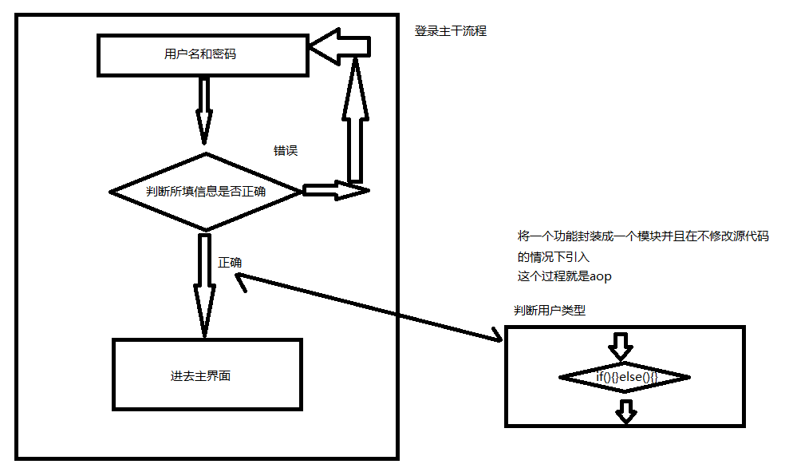

###**一、底层原理**
    1.aop底层实现原理是使用的动态代理
        1-1：有接口的情况使用jdk的
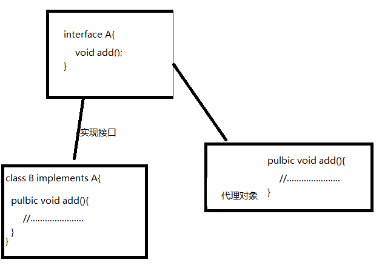

        1-2：无接口的情况下使用cglib的动态代理
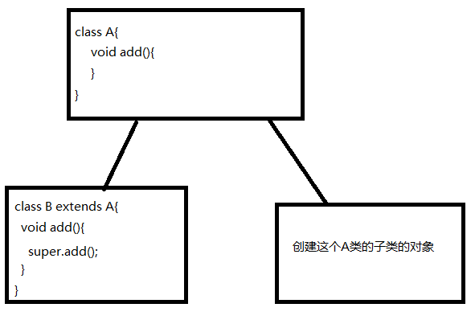

    2.使用JDK实现动态代理，增强某个类的方法
        例如：在services包中的login方法的增强
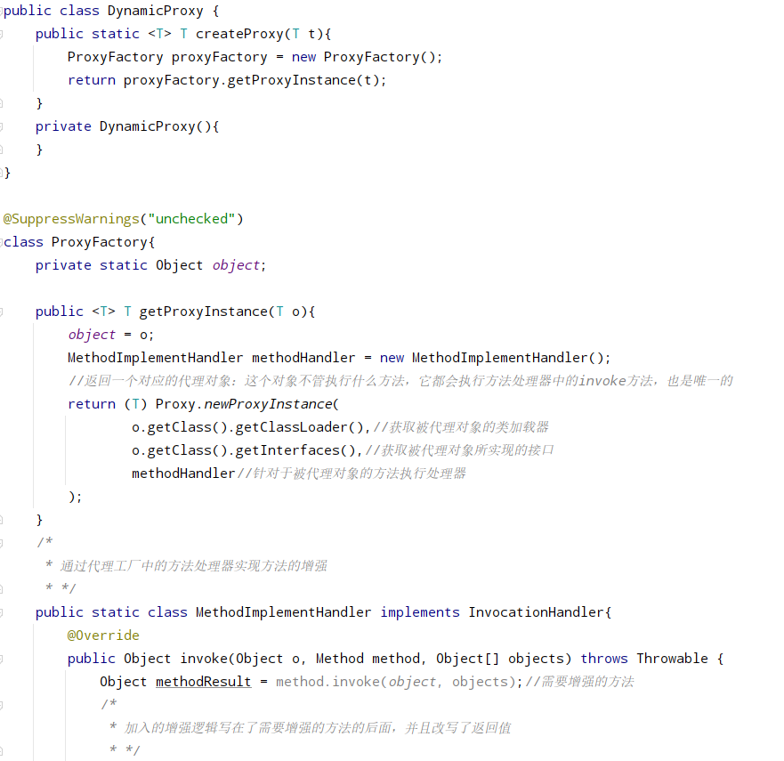

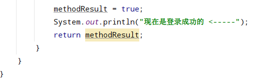

        测试调用：
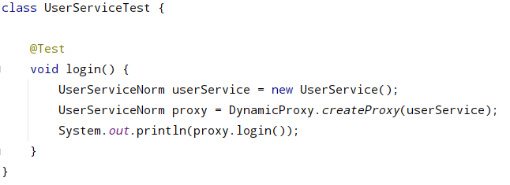

        测试结果：
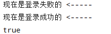

###**二、操作术语**
(1)连接点
    :可以被增强的方法    

(2)切入点
    :实际上被增强的方法

(3)通知（增强）
    
    1.被增强方法的逻辑部分
    2.通知的类型

        *前置通知
        *后置通知 
        *环绕通知
        *异常通知
        *最终通知 -- finally

(4)切面
    :将通知应用到切入点的过程

###**三、AOP操作的准备**
####1.spring框架基于aspectJ实现aop操作

    *aspectJ是独立于spring的，需要结合使用
####2.两种方式
    
    基于xml配置文件实现
    基于注解方式实现(使用较多)

####3.在项目中引入相关依赖（maven）
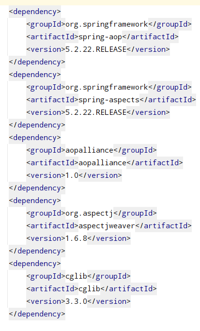


####4.切入点表达式
(1)作用：用于对哪个类中的哪些方法增强

(2)语法结构

    execution([权限修饰符][返回类型][全类名][方法名称][(参数名称)])

    示例一：对com.spring.mvc.services.UserService中的login增强
            execution(*com.spring.mvc.services.UserService.login(..))

    示例二：对com.spring.mvc.services.UserService中的所有方法增强
            execution(*com.spring.mvc.services.UserService.*(..))

    示例二：对com.spring.mvc.services包中的所有类的所有方法增强
            execution(*com.spring.mvc.services.*.*(..))

####5.AOP操作
#####AspectJ注解（一）

- 创建原始类，定义一个需要增强的方法

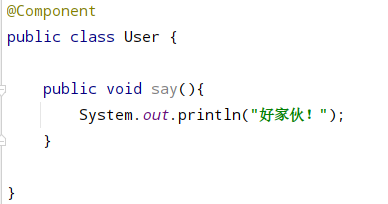
  
- 创建增强类，定义这些个增强方法的逻辑,让不同方法代表不同的通知类型

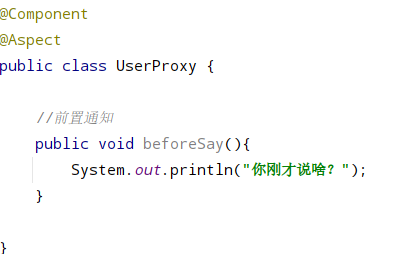

- 进行通知的配置
    - 在spring配置文件中，开启注解扫描创建对象(也可以用配置类)
    - 在增强类上添加@Aspect注解
    - 在spring配置文件中，开启生成代理对象
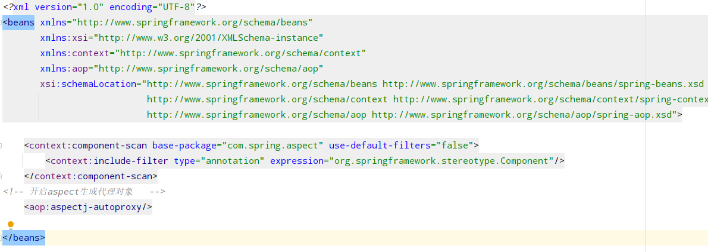
      

- 配置不同类型的通知：通知方法上添加通知类型注解，使用切入点表达式进行配置

```java
    //前置通知
    @Before(value = "execution(* com.spring.aspect.annotation.User.say(..))")
    public void beforeSay() {
        System.out.println("你刚才说啥？");
    }

    //后置通知 -- 被增强方法执行完后，这个方法就会接着执行
    @AfterReturning(value = "execution(* com.spring.aspect.annotation.User.say(..))")
    public void afterReturningSay() {
        System.out.println("好吧！");
    }

    //环绕通知
    @Around(value = "execution(* com.spring.aspect.annotation.User.say(..))")
    public void aroundSay(ProceedingJoinPoint point) throws Throwable {
        System.out.println("对话开始时间：" + LocalDateTime.now().getYear() + "年-"
                           + LocalDateTime.now().getMonth() + "月-"
                           + LocalDateTime.now().getDayOfMonth() + "天"
        );
        point.proceed();
        System.out.println("对话结束时间：" + LocalDateTime.now().getYear() + "年-"
                           + LocalDateTime.now().getMonth() + "月-"
                           + LocalDateTime.now().getDayOfMonth() + "天"
        );
    }

    //异常通知
    @AfterThrowing(value = "execution(* com.spring.aspect.annotation.User.say(..))")
    public void exceptionSay() {
        System.out.println("电话怎么挂了？算了");
    }

    //最终通知 -- finally
    @After(value = "execution(* com.spring.aspect.annotation.User.say(..))")
    public void finallySay() {
        System.out.println("-------------");
    }
```
- 增强类中定义公共切入点

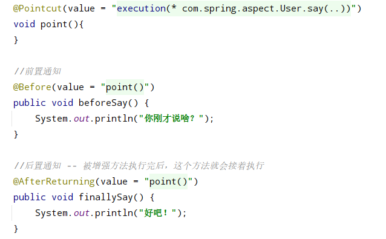
  
- 多个增强类对同一个方法增强，设置增强类的优先级

        给类上添加@Order(数字值) 值越小优先级越高
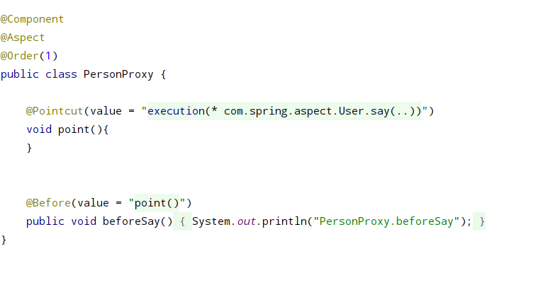

#####AspectJ配置文件（二）
- 创建增强类和被增强类

```java
@Component
public class BookProxy {

    public void getNamePlus(){
        System.out.println("加钱了！！！！！！！！！");
    }

}
@Component(value = "book_")
public class Book {
    public void getName(){
        System.out.println("钱没了。。。。。");
    }
}
```  

- spring配置文件中

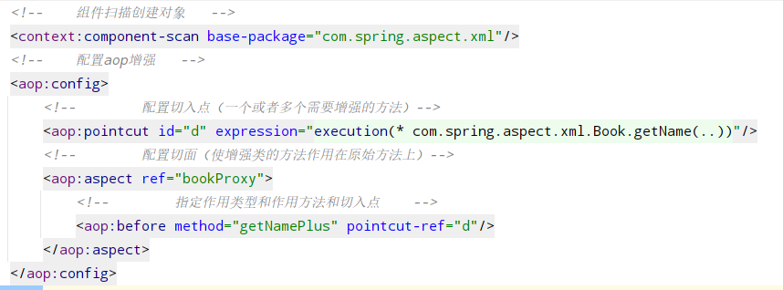


#####AspectJ完全注解开发（三）

```java
import org.springframework.context.annotation.ComponentScan;
import org.springframework.context.annotation.Configuration;
import org.springframework.context.annotation.EnableAspectJAutoProxy;

@Configuration
@ComponentScan(basePackages = {"com.spring.aspect.xml"})
@EnableAspectJAutoProxy
public class SpringConfig {
}
```
