# **IOC:控制反转（Inversion of Control，缩写为IoC）**

    1.对象的创建和对象的调用过程，交给spring管理
    2.目的：降低类之间的耦合度

###**一、底层原理**

    xml解析、工厂模式、反射

### **二、接口：(本质)Factory**

1.ioc思想基于容器完成，底层就是对象工厂

2.两种实现方式：

    _(1)BeanFactory:不提供给开发人员使用
            *加载配置文件时不会创建对象，在获取对象的时候才会
    
    _(2)ApplicationContext:BeanFactory的子接口
            *一步到位，加载并创建对象（对于bean标签的scope为prototype的除外）

3.ApplicationContext实现类：

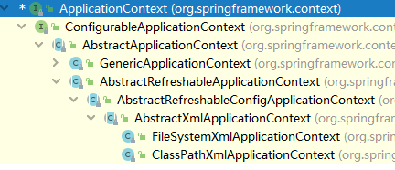

    FileSystemXml...
    ClassPathXml... 两种需要的配置文件的路径不同

###**三、bean管理: xml , 注解**
    两个操作：spring创建对象、注入属性
    ------------------------------------
    两种方式：
    1.基于xml方式
    2.基于注解方式
#### 备注：相关的类及包已移动到xml包下
####**bean管理（基于xml方式）**
######**1.在spring配置文件中、使用bean标签、添加对应的属性实现对象的创建**

    
    id:作为key，任意名字，唯一标识
    class:全类名，作为key对应的value（这个类必须有无参构造）
    name:早期属性、可以key值可以有特殊符号

    创建对象时，默认执行无参构造方法

######**2.注入属性-基本类型属性**
        DI:依赖注入，就是注入属性
            1.通过有参构造和设置器注入
            2-1.通过spring配置文件注入属性 --- 要有对应getter和setter
            name：属性名 value：要注入的值 标签：property
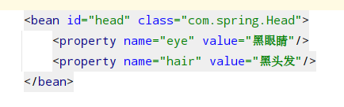

            2-2：通过spring配置文件注入属性 --- 要有对应有参构造方法
            name：构造器的参数名 value：要注入的值 标签：property
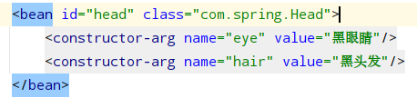

         注入其它特殊属性
        （1）null值
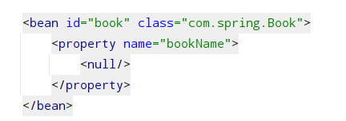

        （2）属性值包含有特殊符号
            可以进行字符转义例如&lt; &gt;
            也可以如下图：
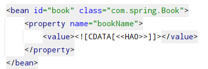

######**3.注入属性-外部bean（用的较多）**
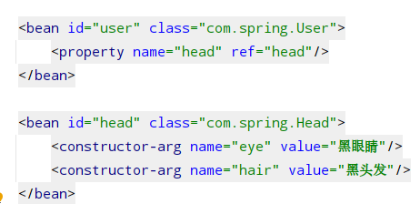

######**4.注入属性-内部bean和级联**
        （1）内部bean,在一个bean标签内的property标签内嵌套一个bean标签即可
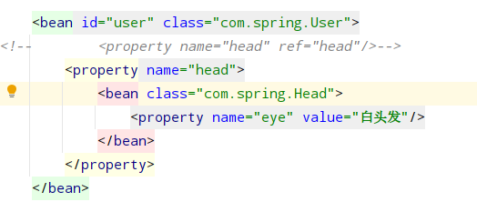

        （2）级联（给另一个对象的属性赋值）
            前提是要引用了另一个对象，且引用类中要有getter方法
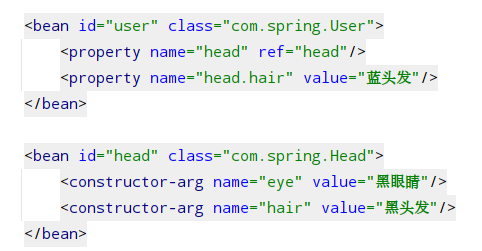

######**5.注入属性-集合类型**
        1-1：数组类型注入

        1-2：set和list集合注入

        1-3：map集合注入
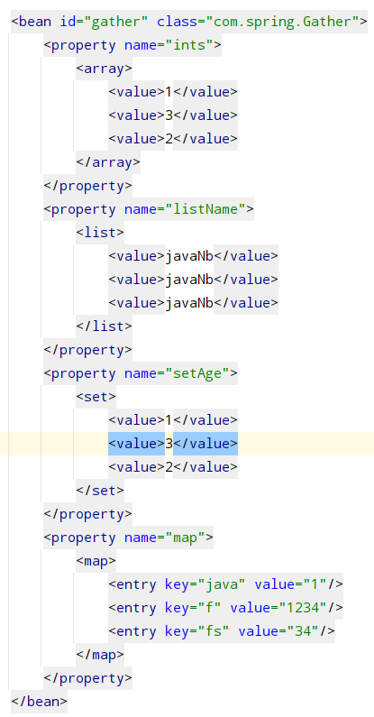

        2-1:集合中对象类型的注入(以下时gather中静态内部类的对象的注入)
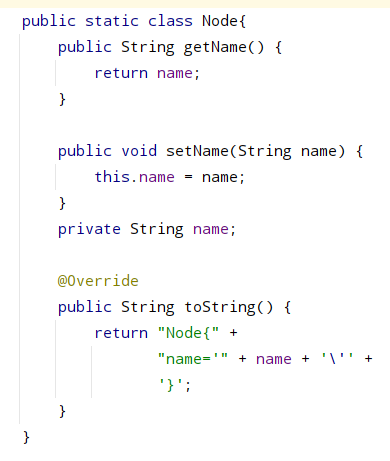

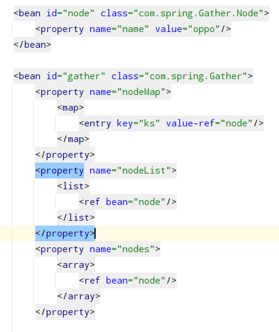

        2-2：在配置文件中提取集合
            1.指定util命名空间
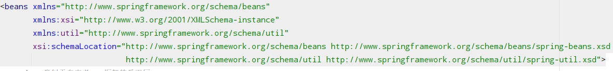

            2.注入使用
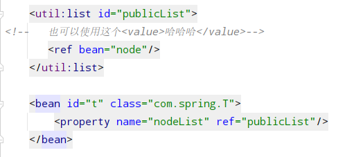

######**6.工厂bean**
        1.创建一个实现factorybean接口的类（指定泛型的类型，也就是返回的类型）
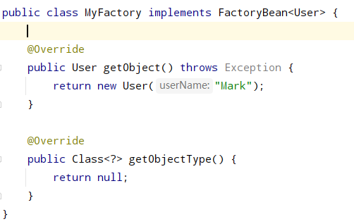
        
        2.配置文件中引入这个类
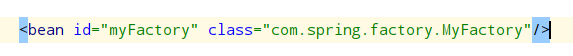

        3.获取这个类的对象，但是实际上返回的是一个User
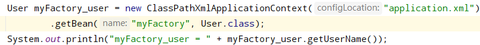

######**7.bean的作用域（单实例和多实例）**
        1.spring配置文件bean标签中的scope属性有两个值：
            singleton：默认值，设置为单例对象
            prototype：可选值，设置为多例对象
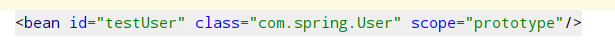

        2.两种值的区别：
            设置scope为singleton的时候，配置文件加载时就会创建这个对象（唯一的）
            设置scope为prototype的时候，配置文件加载时不会创建这个对象，而是每次在getBean()的时候创建对象（不唯一的）
            过程如下图所示：
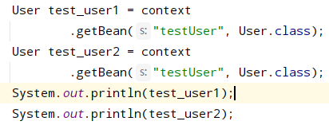
            
            结果如下图所示：
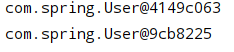

######**8.spring中bean的生命周期**
    一共七个步骤 （其中后置处理器（此后会是所有bean的处理器）也需要在配置文件中指定(bean）：
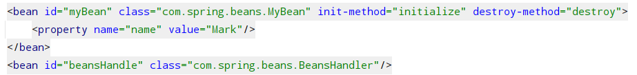

        1.创建所有bean对应的类的对象（通过无参构造器）
        2.设置这个对象内部属性值（通过setter方法）
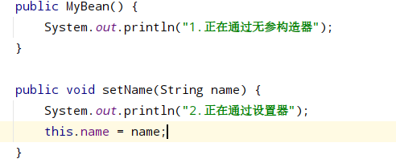

        handler_3.将这个对象放到后置处理器（before）-- 创建BeanPostProcessor的实现类，其中有个postProcessBeforeInitialization方法
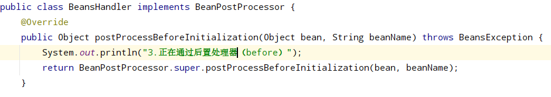

        4.执行这个对象内部定义的初始化方法 -- 配置文件中属性init-method中指定
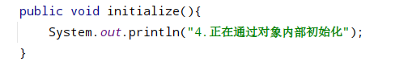

        handler_5.将这个对象放到后置处理器（after） -- 创建BeanPostProcessor的实现类，其中有个postProcessAfterInitialization方法
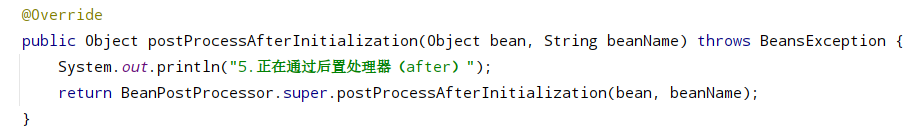

        6.获取这个对象（通过getBean方法）
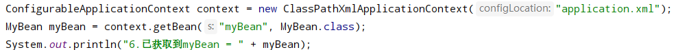

        7.执行这个对象内部定义的销毁方法 （外部调用close方法,否则不会执行） -- 配置文件中属性destroy-method中指定
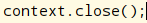

######**9.spring中bean的自动装配(引用bean)**
        根据bean标签属性autowire的值来判定使用哪种方式装配
            常用的有byName,byType
        1.byName:根据这个对象的属性名来引入外部bean（id名字要对应）
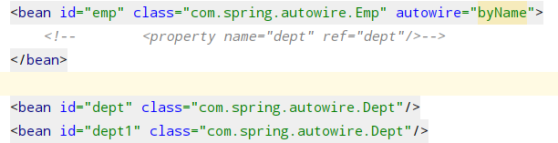

        2.byType:根据这个对象的属性类型来引入外部bean（xml文件中不能存在多个类型相同的外部bean）
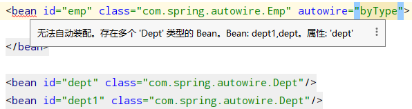

######**10.外部属性文件**
        1.定义命名空间：context
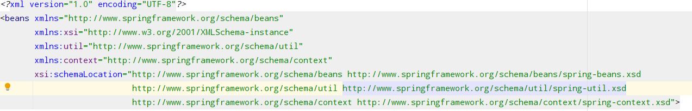

        2.引入外部属性文件
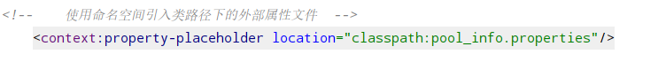

        3.配置连接池读取文件信息
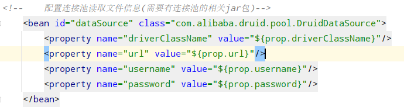

        备注：可省略前两步--需要连接池jar包
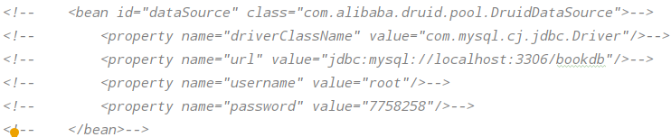

#### 备注：相关类及包在annotation包下
####**bean管理（基于注解方式）**
######**1.使用注解实现对象的创建和属性的注入**
    目的：简化xml配置
        1.针对于bean管理中提供创建对象的四个注解
            (1) @Component 
            (2) @Controller --  用于controller层
            (3) @Service    --  用于service层
            (4) @Repository -- 用于dao层
        *这四种功能是一样的 都能用来创建对象（bean的实例）
        
        2.创建步骤：
            2-1.引入依赖spring-aop-x.x..jar(maven项目直接在pom.xml文件中追加。。。)
             如下图所示：
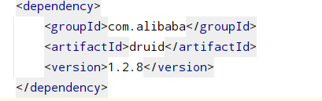

            2-2.开启组件扫描（告知spring框架，在哪些地方使用了注解）
                1.定义命名空间context
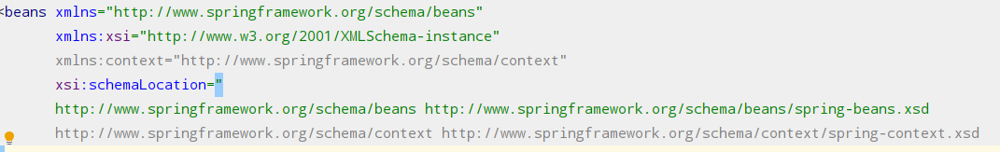

                2.配置文件中写入扫描的包
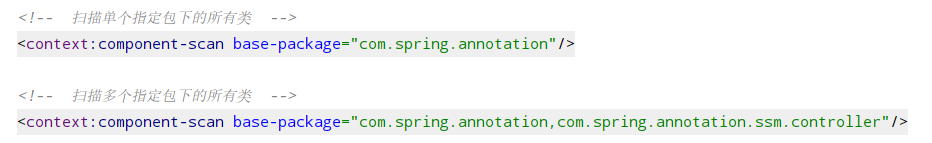

            2-3.创建一个使用了上面注解的类
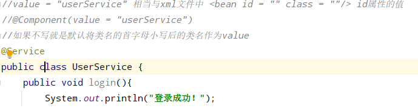

        3.组件扫描的配置
            示例一：
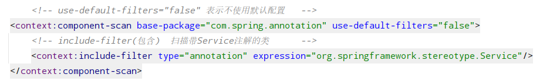

            示例二：
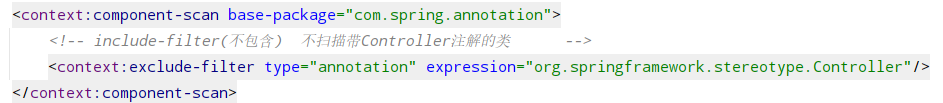

######**2.注入属性@Autowired和Qualifier**
（1）@Autowired:根据属性类型进行注入

        1.创建service层和dao层的对象
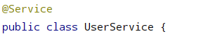
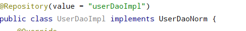
        
        2.service层对象引用dao并使用@Autowired修饰
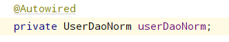

（2）@Qualifier:根据属性名称进行注入

        和@Autowirde搭配使用，其中value是引用的对象的别名相关于xml文件中的id
        （一个接口可能有多个实现类，需要根据名字来区分）
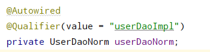

（3）@Resrouce: 类型和名称注入 兼具

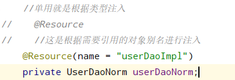

（4）@Value:注入普通类型属性

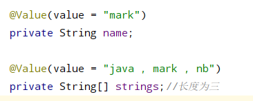

######**3.spring的完全注解开发**
(1)创建配置类，替代xml配置文件

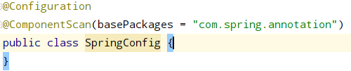

(2)测试

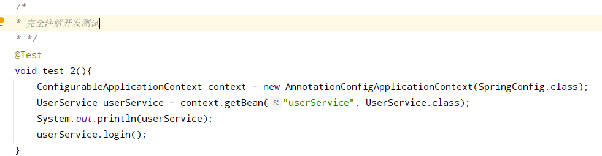

