#JDBC Template
    spring对jdbc进行封装、使用jdbctemplate方便实现对数据库的访问

###1.引入相关依赖
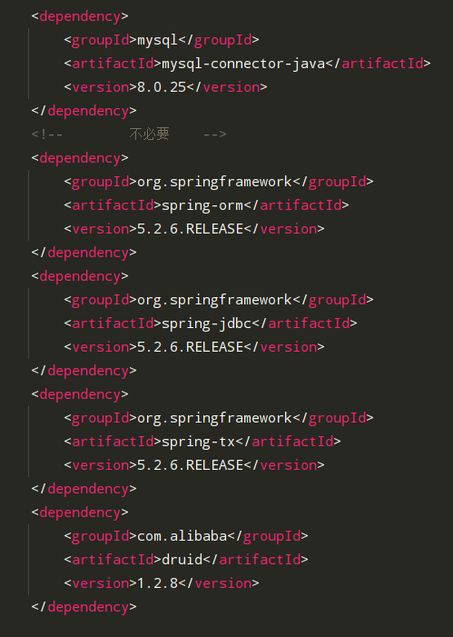

###2.配置数据库连接池
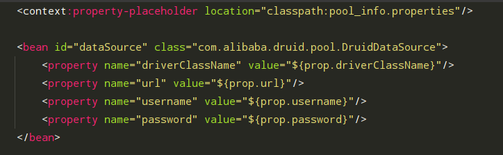

###3.创建JDBCTemplate对象并注入连接池
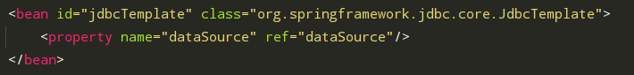

###4.创建测试类
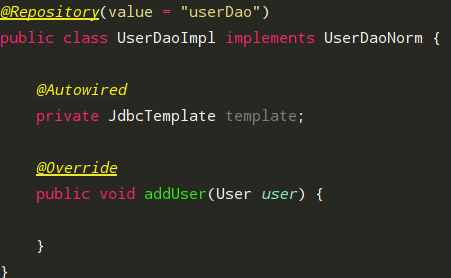

(1)添加操作

- 单个添加

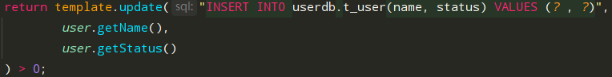
  
- 批量添加(batch)

  值得注意的是要用object对象数组封装一个user对象放入list集合

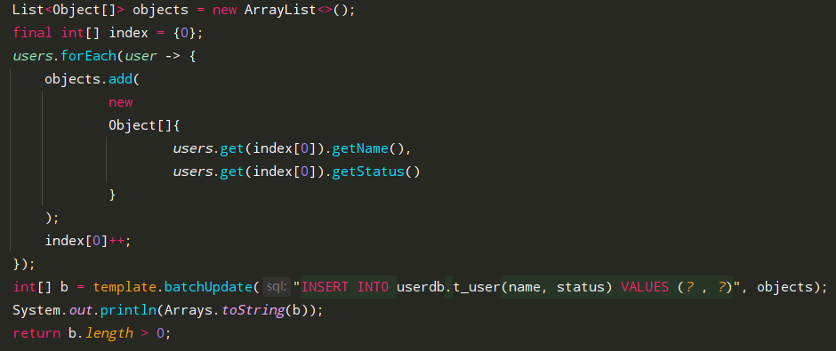

(2)修改操作

- 单个修改

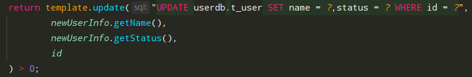

- 批量修改(batch)

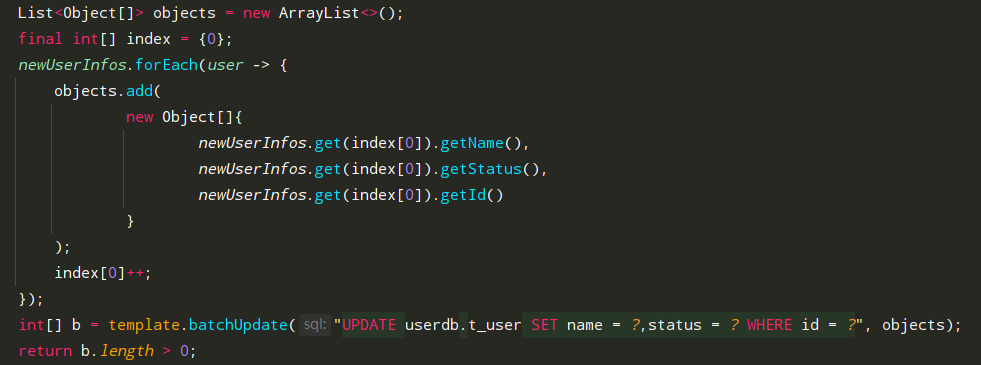

(3)删除操作

- 单个修改
  
  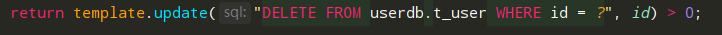
  
- 批量删除(batch)

  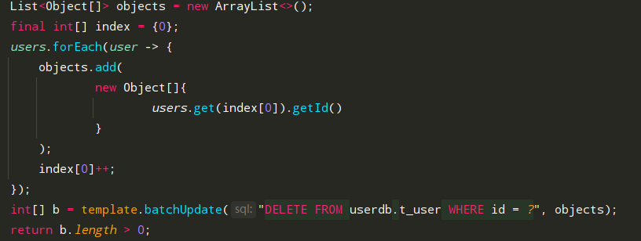

(4)查询操作 -- (在spring的jdbcTemplate的查询中RowMapper接口是关键)

        其中要通过RowMapper接口的映射器实现类来封装不同的数据类型

- 聚合查询(查询用户数量)
  
    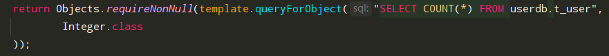
  
- 条件查询
    - 查询指定用户信息--返回单个对象
    
    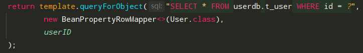
      
    - 查询指定用户信息--返回多个对象(集合)

    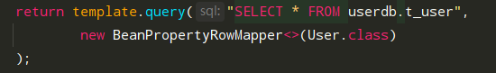