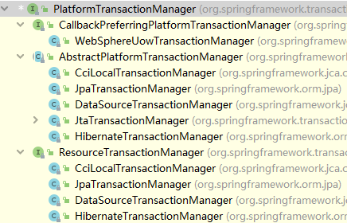
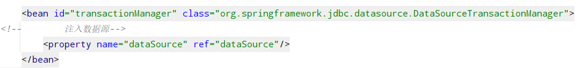
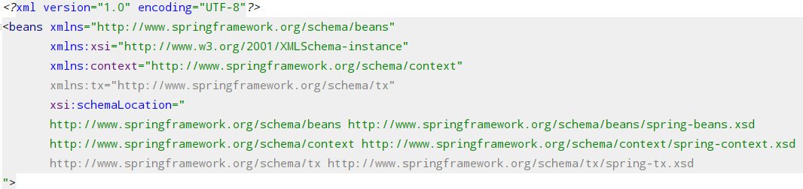
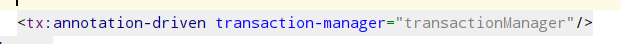
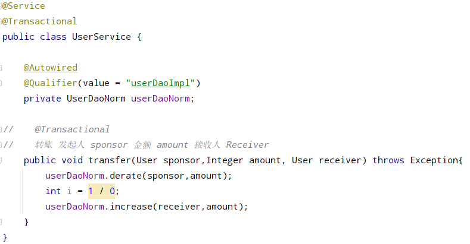
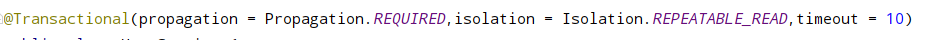
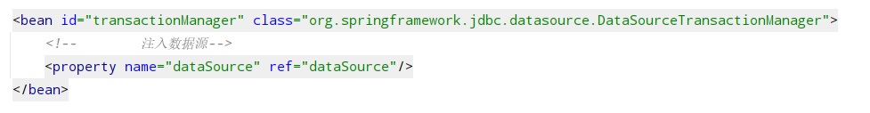
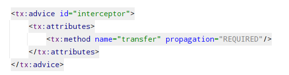
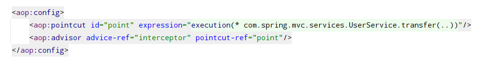

# Spring 事务
(1)事务是数据库操作的基本单元，逻辑上一组操作

(2)事务的四个特性(ACID)

    1.原子性：事务的操作要么全部成功，要么全部失败
    2.一致性：不管是回滚还是提交，事务操作的数据总量不变
    3.隔离性：若有多人对同一条记录进行操作，则互不影响
    4.持久性：表中数据预期与业务情况一致，且永久性变化

##一、Spring 事务管理介绍
###1.事务管理建议添加到service层（JavaEE中的三层结构）

###2.在spring中进行事务管理操作（两种方式）
####（1）编程式事务管理
####（2）声明式事务管理（常用）

###3.声明式事务管理（底层使用AOP）
####基于注解（常用）
####基于xml配置文件

###4.常用API
PlatformTransactionManager顶级接口针对不同框架提供不同的实现类



##二、Spring 注解声明式事务管理
###1.在配置文件中配置事务管理器



###2.在配置文件中开启事务注解
####（1）引入名称空间:tx


####（2）开启事务注解


####(3)在类（这个类的所有方法）或者方法上添加注解


###3.声明式事务管理参数配置
```java
    Propagation propagation() default Propagation.REQUIRED;

    Isolation isolation() default Isolation.DEFAULT;

    int timeout() default -1;

    boolean readOnly() default false;

    Class<? extends Throwable>[] rollbackFor() default {};

    String[] rollbackForClassName() default {};

    Class<? extends Throwable>[] noRollbackFor() default {};

    String[] noRollbackForClassName() default {};
```
- Propagation : 事务的传播行为
    当一个事务方法被另一个事务方法调用时，这个事务方法如何进行


|行为         |定义                                                     |
|-----------|--------------------------------------------------------|
|REQUIRED  | 支持当前事务，如果当前没有事务，就新建一个事务。这是最常见的选择。|
|SUPPORTS  |  支持当前事务，如果当前没有事务，就以非事务方式执行。            |
|MANDATORY | 支持当前事务，如果当前没有事务，就抛出异常。                 |
|REQUIRES_NEW | 新建事务，如果当前存在事务，把当前事务挂起。              |
|NOT_SUPPORTED | 以非事务方式执行操作，如果当前存在事务，就把当前事务挂起。|
|NEVER |  以非事务方式执行，如果当前存在事务，则抛出异常 。                |
|NESTED | 如果当前存在事务，则在嵌套事务内执行。如果当前没有事务，则进行与PROPAGATION_REQUIRED类似的操作。|

- Isolation : 事务的隔离级别（针对事务的操作有隔离特性）
    三个读问题：

|问题     |       解释| 解决              |
|---    |----       |    ---------                   |
|  脏读     |  一个未提交事务读取到了另一个未提交事务的数据         | READ_UNCOMMITTED  |
|  不可重复读 | 一个未提交事务读取到了另一个已提交事务修改后的数据          |REPEATABLE_READ （常用） |
|  幻读     |  一个未提交事务读取到了另一个已提交事务添加后的数据         | READ_COMMITTED |

- timeout : 超时时间，默认为 -1s（不限时间）
  
        未在指定的时间内提交数据将会进行事务回滚
  
- readOnly : 是否只读,默认为false(可以进行增、删、改、查、)
  
        true：只能select

- rollbackFor : 根据抛出的指定的异常实现事务回滚

- noRollbackFor : 根据抛出的指定的异常不实现事务回滚




##三、Spring xml声明式事务管理

###1.在配置文件中配置事务管理器



###2.在配置文件中配置通知



###3.在配置文件中配置切入顶和切面



